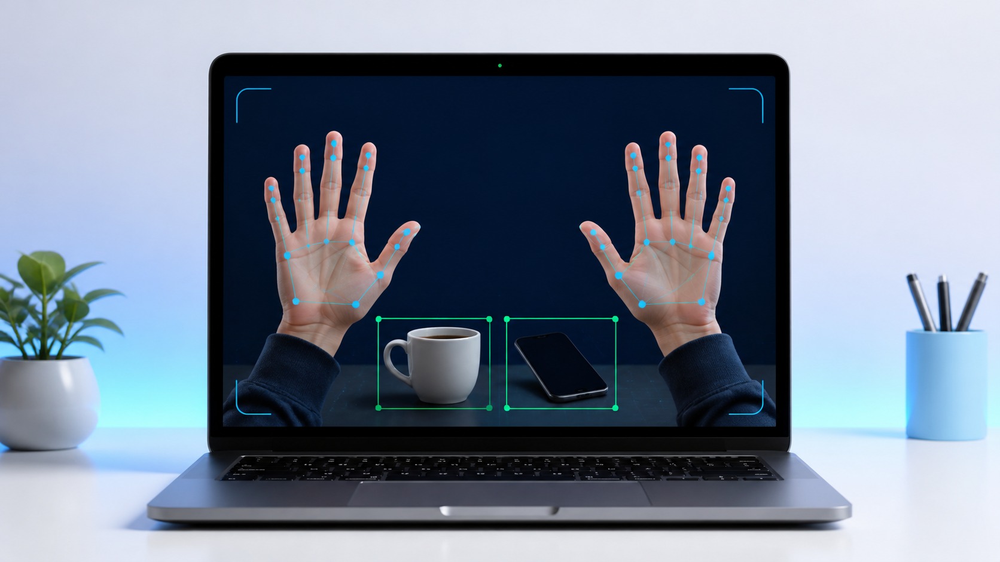

# Control by Hand

<p align="center">
  
</p>

<p align="center">
  <strong>A local, real-time webcam tool for finger counting, face landmarks, and everyday object detection.</strong>
</p>

<p align="center">
  <a href="#quick-start">Quick start</a> ·
  <a href="#how-it-works">How it works</a> ·
  <a href="#troubleshooting">Troubleshooting</a>
</p>

## What is this?

**Control by Hand** opens your webcam and runs computer-vision models on the live video. It detects up to two hands, counts the fingers held up on each hand, and can detect common objects such as a cup, chair, or cell phone.

Despite the name, this project **does not control the mouse, keyboard, or any other application**. It is a visual demonstration tool: all processing happens in the app window and the result is shown as overlays on the camera feed.

## Features

- Counts open fingers on up to two hands independently (0–5 per hand).
- Shows the arithmetic total when both hands are visible, for example `5 + 5 = 10`.
- Draws hand landmarks and hand-side labels (`Left` / `Right`).
- Uses a local YOLO model to identify common objects and draw labeled bounding boxes.
- Tracks basic face landmarks and reports when both eyes appear closed.
- Smooths finger counts over recent frames to reduce one-frame detection flicker.
- Runs from your webcam; the included YOLO model is stored locally in the repository.
- Supports macOS, Windows, and Linux when a compatible Python and webcam are available.

## How it works

The camera frame is mirrored, then processed by two MediaPipe pipelines and, optionally, an Ultralytics YOLO pipeline:

```text
Webcam frame
   │
   ├── MediaPipe Hands ──> hand landmarks ──> finger count per hand ──> live overlay
   ├── MediaPipe Face Mesh ──> eye landmarks ──> eye-closure status ──> live overlay
   └── YOLO11n (every 8 frames) ──> object boxes + labels ──> live overlay
```

Finger counting checks whether each finger is extended using landmark positions and joint angles. The program keeps a short history of values and displays the median value, making the counter steadier when a landmark briefly shifts.

Object recognition is performed by `yolo11n.pt`, the compact YOLO model included in this repository. It runs every eighth frame to keep the camera preview responsive.

## Requirements

| Requirement | Notes |
| --- | --- |
| Python | **3.10, 3.11, or 3.12**. Python 3.14 is not supported by this project’s pinned MediaPipe version. |
| Webcam | A working webcam accessible to the terminal or IDE that starts the program. |
| Internet | Required only for the first dependency installation. The included YOLO model means no model download is normally needed. |
| Disk space | Allow room for Python packages; `ultralytics` may install PyTorch as a dependency. |

### What `requirements.txt` does

`requirements.txt` is cross-platform. `pip` automatically detects macOS, Windows, or Linux as well as the processor architecture, then selects the matching pre-built package wheels.

`pip install -r requirements.txt` is already incremental: it **does not reinstall or download packages that are already installed and satisfy the requested versions**. It only installs missing or incompatible packages and their required dependencies. A requirements file cannot install Python itself, so install a supported Python version first.

The file installs:

- `mediapipe` — hand and face landmark detection.
- `opencv-contrib-python` — webcam access, drawing, and the preview window.
- `numpy` — numerical support required by the vision libraries.
- `ultralytics` — YOLO object detection; it brings its required runtime dependencies, including PyTorch, when needed.

## Quick start

### Option A — Smart installer (recommended)

From the project folder, run the installer with a supported Python interpreter:

**macOS / Linux**

```bash
python3.12 install.py
```

**Windows (PowerShell)**

```powershell
py -3.12 install.py
```

The installer automatically:

1. Verifies that Python is version 3.10–3.12.
2. Detects the operating system.
3. Creates `.venv` if it does not already exist.
4. Installs only missing or incompatible packages from `requirements.txt`.
5. Prints the exact command to start the app.

Then start the application:

**macOS / Linux**

```bash
source .venv/bin/activate
python hand_control.py
```

**Windows (PowerShell)**

```powershell
.venv\Scripts\Activate.ps1
python hand_control.py
```

> If you are already inside the project directory and `.venv` has been installed, the two commands above are all you need.

### Option B — Manual installation

Use this when you prefer to manage the environment yourself.

**macOS / Linux**

```bash
python3.12 -m venv .venv
source .venv/bin/activate
python -m pip install -r requirements.txt
python hand_control.py
```

**Windows (PowerShell)**

```powershell
py -3.12 -m venv .venv
.venv\Scripts\Activate.ps1
python -m pip install -r requirements.txt
python hand_control.py
```

## Running the application

When the camera window opens, hold a hand facing the camera and extend the fingers you want to count. For the best result, keep your palm visible, fingers separated, and hand steady for about a second.

Show one or more everyday objects to the camera to see object labels. Detection quality depends on lighting, visibility, distance, and whether the object belongs to the YOLO model’s known classes.

### Command-line options

```bash
python hand_control.py --help
```

| Command | Description |
| --- | --- |
| `python hand_control.py` | Starts hand, face, and object detection. |
| `python hand_control.py --no-objects` | Starts hand and face detection only; skips YOLO object detection for a lighter/faster run. |
| `python hand_control.py --model path/to/model.pt` | Uses a different local YOLO `.pt` model file. |

## Stopping the application

Click the camera-preview window so it has keyboard focus, then press **Q** or **Esc**. The window closes and the webcam is released.

If the terminal is stuck or the window cannot receive the key press, return to the terminal and press **Ctrl+C** once to stop the program.

To leave the Python virtual environment after closing the app, run:

```bash
deactivate
```

## Camera permissions

The operating system may ask for camera access the first time you run the program. Grant access to the app that launched it—usually Terminal, iTerm, VS Code, or PyCharm.

### macOS

Open **System Settings → Privacy & Security → Camera** and enable the terminal or IDE you use to run the program. Close and reopen the terminal after changing the permission if necessary.

### Windows

Open **Settings → Privacy & security → Camera**, enable camera access, and ensure desktop apps are allowed to access the camera.

### Linux

Ensure your user is allowed to access the video device (commonly `/dev/video0`). On some distributions, this means being in the `video` group. Flatpak or Snap terminals may also need explicit camera permission.

## Troubleshooting

### `No module named ...`

Activate the virtual environment and install the requirements again:

```bash
source .venv/bin/activate  # Windows: .venv\Scripts\Activate.ps1
python -m pip install -r requirements.txt
```

### `Camera not found` or a black camera window

- Close Zoom, Teams, browser tabs, or other apps using the webcam.
- Check the camera permission instructions above.
- Disconnect and reconnect an external webcam.
- If your camera is not the default camera, change `cv2.VideoCapture(0)` in `hand_control.py` to another index such as `1`.

### MediaPipe cannot be installed

Confirm that you are using Python 3.10–3.12:

```bash
python --version
```

If your default `python` is 3.14, explicitly use a supported interpreter, for example `python3.12 install.py` on macOS/Linux or `py -3.12 install.py` on Windows.

### Object detection does not appear

- Make sure `yolo11n.pt` is present next to `hand_control.py`.
- Start normally, without `--no-objects`.
- Use a well-lit scene and show a common object clearly.
- Try `python hand_control.py --no-objects` to confirm that the webcam and hand pipeline work independently of YOLO.

### The finger count is inaccurate

- Face your open palm toward the camera.
- Keep the wrist and fingertips in frame.
- Separate fingers and avoid motion blur.
- Use brighter, even lighting.
- Hold the gesture still briefly so the smoothing buffer can stabilize.

## Project structure

```text
.
├── assets/
│   └── control-by-hand-demo.png  # README illustration
├── hand_control.py               # Application entry point
├── install.py                    # Cross-platform environment installer
├── requirements.txt              # Python dependencies and version constraints
├── yolo11n.pt                    # Local YOLO object-detection model
└── README.md                     # This guide
```

## Privacy and limitations

- The application analyzes the live camera frames on the computer running it. It does not include code to upload camera frames or send them to a remote service.
- Object labels come from the selected YOLO model and may be wrong, missing, or affected by lighting and occlusion.
- Eye-closure status is a simple landmark-based estimate; it is not suitable for medical, safety-critical, or identity-verification use.
- This project does not perform operating-system input control. It only displays visual results.

## Contributing

Before opening a change, create and activate the virtual environment, run the app, and verify that the camera preview still opens. Keep new dependencies pinned or bounded in `requirements.txt` when they affect reproducibility.
